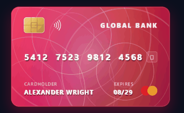
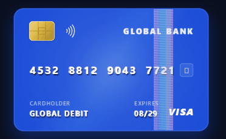
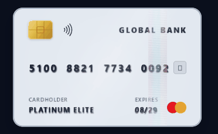
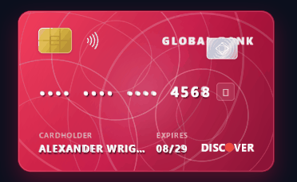

# horizontal_credit_card

A modern, customizable horizontal credit and debit card UI widget for Flutter fintech applications with interactive 3D perspective tilt, gyroscopic specular reflection, 180° flip animation, tap-to-reveal privacy masking, dynamic 60-second rolling CVV, one-tap clipboard copying, holographic security foil shimmers, physical 3D rim thickness, and frozen card states.

Built with **zero external dependencies** on top of the native Flutter SDK.

---

## Showcase

| 3D Physical Rim & Embossed Typography | Dynamic Holographic Security Stripe |
| :---: | :---: |
|  |  |
| **Platinum Elite Hologram Ribbon** | **Security Badge & Instant Copy Button** |
|  |  |

---

## Features

* **ISO/IEC 7810 ID-1 Standard Ratio:** Native landscape aspect ratio (1.586 : 1) tailored for classical horizontal payment cards.
* **Interactive 3D Perspective Physics:** Pointer drag and gyroscopic angle deflection calculated via 4x4 homogeneous transformation matrices (`Matrix4`).
* **Physical 3D Thickness:** Multi-layered rim edge rendering simulating real physical plastic card depth (default 3.5 logical pixels).
* **Dynamic Specular Lighting:** Ambient light sweep reacting dynamically to tilt coordinate changes.
* **Holographic Security Foil:** Shimmering rainbow diffraction grating with mathematical optical color shifts in full-surface, security stripe, or security badge layouts.
* **Dynamic 60-Second Rolling CVV:** Timed dynamic security code with an animated countdown progress ring and automated code rotation.
* **Quick-Copy Card Number:** Subtle one-touch copy button with animated checkmark feedback, whitespace sanitization, and callback hooks.
* **180° Perspective Flip:** Smooth hardware-accelerated 3D rotation revealing the magnetic stripe, signature panel, and CVV on the back.
* **Sensitive Data Masking:** Tap-to-reveal privacy masking for 16-digit card numbers and CVV codes.
* **Financial Security States:** Built-in support for `isFrozen` (frosted crystal overlay with padlock) and `isExpired` states.
* **Letterpress Embossed Typography:** Stamped physical 3D bevels, silver/gold liquid foil stamping, and flat print finishes.
* **Slot Injections:** Custom widget slots for bank branding logos and payment networks.
* **Zero External Dependencies:** Built purely on Flutter core SDK for 100% enterprise compliance, rock-solid stability, and 120 FPS performance.

---

## Getting Started

Add `horizontal_credit_card` to your `pubspec.yaml`:

```yaml
dependencies:
  horizontal_credit_card: ^0.0.1
```

Or install it from your terminal:

```bash
flutter pub add horizontal_credit_card
```

Import it in your Dart code:

```dart
import 'package:horizontal_credit_card/horizontal_credit_card.dart';
```

---

## Usage Examples

### 1. Basic Interactive Card

```dart
import 'package:flutter/material.dart';
import 'package:horizontal_credit_card/horizontal_credit_card.dart';

class BasicCardDemo extends StatelessWidget {
  const BasicCardDemo({super.key});

  @override
  Widget build(BuildContext context) {
    return Center(
      child: HorizontalCard(
        cardNumber: '4532 8812 9043 7721',
        cardHolder: 'Alexander Wright',
        expiryDate: '09/29',
        cvv: '842',
        brand: CardBrand.visa,
        cardTheme: CardPresets.crimsonOrbit,
        textFinish: CardTextFinish.embossed,
        enableTilt: true,
        thickness: 3.5,
      ),
    );
  }
}
```

### 2. Holographic Security Foil with Quick-Copy Button

```dart
HorizontalCard(
  cardNumber: '5412 7512 3412 8901',
  cardHolder: 'Sophia Montgomery',
  expiryDate: '12/28',
  cvv: '593',
  brand: CardBrand.mastercard,
  cardTheme: CardPresets.solidCobaltBlue,
  isHolographic: true,
  holoConfig: const HoloFoilConfig(
    style: HoloStyle.securityStripe,
    intensity: 0.85,
    stripeWidthFactor: 0.12,
    stripeAlignment: -0.55,
  ),
  enableCopy: true,
  cleanCopiedNumber: true,
  onCardNumberCopied: (number) {
    ScaffoldMessenger.of(context).showSnackBar(
      SnackBar(content: Text('Copied card number: $number')),
    );
  },
)
```

### 3. Dynamic Rolling CVV with Countdown Ring

```dart
HorizontalCard(
  cardNumber: '4000 1234 5678 9010',
  cardHolder: 'David Miller',
  expiryDate: '04/27',
  cvv: '123',
  brand: CardBrand.visa,
  cardTheme: CardPresets.solidMatteBlack,
  isDynamicCvv: true,
  dynamicCvvConfig: const DynamicCvvConfig(
    interval: Duration(seconds: 60),
    showCountdownRing: true,
    showCountdownText: true,
    cvvLength: 3,
  ),
)
```

---

## Curated Presets Library (`CardPresets`)

The package includes ready-to-use production card themes categorized into specialized collections:

### 1. Geometric Patterns Collection
* `CardPresets.crimsonOrbit`: Vibrant rose crimson and ruby gradient with intersecting geometric orbital rings.
* `CardPresets.royalAmethyst`: Royal amethyst purple gradient with intersecting geometric orbital rings.
* `CardPresets.oceanAzure`: Ocean cyan and azure gradient with intersecting geometric orbital rings.
* `CardPresets.midnightSapphire`: Deep midnight sapphire navy with luminous geometric orbital rings.
* `CardPresets.amexGreen`: Heritage American Express Green Card with banknote guilloche and centurion watermark.
* `CardPresets.cyberMesh`: High-tech cybersecurity card with isometric grid and cyan glow.

### 2. Minimalist Solid Colors Collection
* `CardPresets.solidMatteBlack`: Stealth matte black finish with silver typography.
* `CardPresets.solidCeramicWhite`: Pure ceramic white card with obsidian typography (Apple Card style).
* `CardPresets.solidCobaltBlue`: International debit cobalt blue with 3D embossed relief.
* `CardPresets.solidHotCoral`: Modern neobank hot coral finish (Monzo style).
* `CardPresets.solidNubankPurple`: Iconic solid electric purple (Nubank style).
* `CardPresets.solidEmerald`: Deep Swiss private banking solid emerald green.

### 3. Luxury Metals Collection
* `CardPresets.obsidianBlack`: Deep obsidian carbon finish with silver borders.
* `CardPresets.appleTitanium`: Minimalist brushed platinum titanium finish.
* `CardPresets.electricPurple`: Vibrant neobank purple gradient.

---

## Physical Typography Relief (`CardTextFinish`)

* `CardTextFinish.embossed`: Stamped physical 3D letterpress with dynamic directional bevel highlights and deep cast shadows.
* `CardTextFinish.silverFoil`: Liquid chrome silver platinum foil stamping.
* `CardTextFinish.goldFoil`: Directional hot-stamped gold bullion foil with specular glint.
* `CardTextFinish.flat`: Crisp anti-aliased digital ink printing.

---

## Holographic Foil Styles (`HoloStyle`)

* `HoloStyle.full`: Dynamic rainbow diffraction wash across the entire card surface.
* `HoloStyle.securityStripe`: Vertical security hologram foil stripe (customizable width and horizontal alignment).
* `HoloStyle.securityBadge`: Compact holographic security badge stamp positioned above the signature or watermark.

---

## Parameters Reference

| Parameter | Type | Default | Description |
| :--- | :--- | :--- | :--- |
| `cardNumber` | `String` | **Required** | 16-digit (or 15-digit) card number |
| `cardHolder` | `String` | **Required** | Cardholder full name |
| `expiryDate` | `String` | **Required** | Expiration date (MM/YY) |
| `cvv` | `String` | **Required** | 3 or 4 digit security code |
| `brand` | `CardBrand` | `CardBrand.visa` | Payment network brand |
| `cardTheme` | `HorizontalCardTheme` | `HorizontalCardTheme.black` | Theme configuration |
| `textFinish` | `CardTextFinish?` | `null` | Typography finish override |
| `thickness` | `double` | `3.5` | Physical 3D thickness (rim edge) in dp |
| `width` | `double` | `320.0` | Outer card width |
| `height` | `double?` | `width / 1.586` | Outer card height |
| `isFlipped` | `bool` | `false` | Programmatic flip to back |
| `isMasked` | `bool` | `false` | Mask sensitive numbers |
| `isDynamicCvv` | `bool` | `false` | Enable rolling dynamic CVV with timer |
| `dynamicCvvConfig` | `DynamicCvvConfig?` | `null` | Rolling CVV duration and appearance |
| `dynamicCvvController`| `DynamicCvvController?` | `null` | External controller for rolling CVV |
| `enableCopy` | `bool` | `false` | Show one-tap copy button next to digits |
| `cleanCopiedNumber` | `bool` | `true` | Strip spaces when copying to clipboard |
| `onCardNumberCopied` | `ValueChanged<String>?` | `null` | Callback after card number is copied |
| `isFrozen` | `bool` | `false` | Frosted ice overlay with padlock |
| `isExpired` | `bool` | `false` | Expired banner overlay |
| `isHolographic` | `bool` | `false` | Enable rainbow holographic foil shimmer |
| `holoConfig` | `HoloFoilConfig?` | `null` | Holographic foil style, intensity, and layout |
| `bankLogo` | `Widget?` | `null` | Custom top-right logo |
| `enableTilt` | `bool` | `true` | Interactive 3D tilt physics |
| `onTap` | `VoidCallback?` | `null` | Tap callback |
| `onFlip` | `ValueChanged<bool>?` | `null` | Flip state listener |

---

## License

This project is licensed under the MIT License - see the [LICENSE](LICENSE) file for details.
