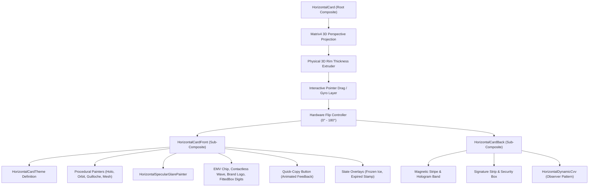

# Architectural Specification & Design Philosophy

`horizontal_credit_card` is engineered from first principles as an enterprise-grade, high-performance visual payment card component for Flutter fintech applications.

This document details the software architecture, design patterns, engineering trade-offs, and technical rationale governing the codebase.

---

## 1. Architectural Principles & Mission

The library is built upon four foundational engineering tenets:

1. **Zero External Runtime Dependencies:** The package relies exclusively on the core Flutter SDK (`flutter/material.dart`, `dart:math`, `dart:ui`). It introduces zero transitive runtime dependencies, guaranteeing enterprise security compliance, deterministic build times, and immunity to third-party dependency deprecation or breakage.
2. **Unopinionated State Interoperability:** The library enforces no proprietary state management framework (such as BLoC, Riverpod, or GetX). All interactive components expose declarative properties, standard controllers (`DynamicCvvController`), and native callback contracts (`onTap`, `onFlip`, `onCardNumberCopied`), enabling frictionless integration into any host architecture.
3. **Hardware-Accelerated 60/120 FPS Rendering:** Rather than relying on heavy raster asset bundles, static PNGs, or external 3D runtimes, all tactile textures, foil highlights, diffraction gratings, and specular reflections are synthesized procedurally via the GPU canvas pipeline (`CustomPainter` and `Matrix4` transformations).
4. **Strict Standard Compliance:** Spatial dimensions, corner radiuses, and physical hardware coordinates strictly adhere to the international **ISO/IEC 7810 ID-1** horizontal credit card standard ($1.586 : 1$ landscape ratio).

---

## 2. Core Architectural Design Patterns

The library leverages classical Gang of Four (GoF) structural and behavioral design patterns tailored to Flutter's reactive widget tree.

---

### 2.1 Composite Pattern (Structural Hierarchy)

The visual representation of the payment card is organized as a hierarchical Composite:

* **Component Interface:** Flutter's abstract `Widget` and `StatefulWidget`.
* **Root Composite (`HorizontalCard`):** Encapsulates optical perspective transformations, gesture detection, spring tilt animation lifecycles, and multi-layered physical rim thickness extrusion.
* **Sub-Composites (`HorizontalCardFront`, `HorizontalCardBack`):** Structural sub-trees managing spatial layouts for their respective card faces.
* **Leaf Nodes (`HorizontalBrandLogo`, `HorizontalEmvChip`, `HorizontalContactless`, `HorizontalDynamicCvv`):** Atomic vector widgets rendering specific physical hardware artifacts.
* **Procedural Vector Layers (`HorizontalHoloFoilPainter`, `HorizontalGuillochePainter`, `HorizontalOrbitalRingsPainter`):** Custom canvas painters rendering diffraction patterns and security watermarks directly into the GPU display list.

**Architectural Value:** Applying matrix rotations and lighting calculations to the root composite transforms all nested child widgets simultaneously, eliminating layout thrashing and redundant per-widget calculations.

---

### 2.2 Observer & Controller Pattern (Dynamic Rolling CVV)

Fintech applications requiring rolling dynamic security codes (e.g. 60-second rotating CVV) require a decoupled reactive mechanism that does not trigger global card re-renders:

* **Observable Controller (`DynamicCvvController`):** Manages code generation, countdown duration, timer state, and listener dispatching via `ChangeNotifier`.
* **Configuration Specification (`DynamicCvvConfig`):** An immutable configuration model defining intervals, digit counts, circular progress ring dimensions, and countdown text displays.
* **Reactive Consumer (`HorizontalDynamicCvv`):** An encapsulated widget listening directly to the controller or managing internal state, rebuilding only the isolated countdown progress canvas and digit text without invalidating the rest of the card back face.

---

### 2.3 Strategy & Factory Pattern (Curated Presets Library)

Configuring a production-ready card involves numerous interconnected parameters (base gradients, specular highlights, border bevels, typography finishes, and holographic foil intensities).

The `CardPresets` class acts as an immutable factory providing pre-calibrated design configurations categorized into specialized collections:

* **Geometric Patterns Collection:** `crimsonOrbit`, `royalAmethyst`, `oceanAzure`, `midnightSapphire`, `amexGreen`, `cyberMesh`.
* **Minimalist Solid Colors Collection:** `solidMatteBlack`, `solidCeramicWhite`, `solidCobaltBlue`, `solidHotCoral`, `solidNubankPurple`, `solidEmerald`.
* **Luxury Metals Collection:** `obsidianBlack`, `appleTitanium`, `electricPurple`.

Every theme allows fine-grained customization via prototype cloning (`copyWith`) and property overrides.

---

### 2.4 Slot-Based Composition (Inversion of Control)

To support custom institutional branding and third-party bank identities, `HorizontalCard` implements slot injection:

* `Widget? bankLogo`: Custom SVG, network image, or vector logo placed at the top-right of the front face.
* `CardTextFinish? textFinish`: Global or per-card override for tactile typography finishes (`embossed`, `silverFoil`, `goldFoil`, `flat`).
* `DynamicCvvController? dynamicCvvController`: Custom external controller for host banking logic synchronization.

If a slot is omitted (`null`), the component cleanly falls back to mathematically calibrated defaults.

---

### 2.5 Procedural Canvas Pipeline & Repaint Isolation

All decorative surfaces and optical security features are synthesized with pure vector `CustomPainter` implementations:

* `HorizontalSpecularGlarePainter`: Ambient light sweep reacting to gyroscopic coordinate matrices.
* `HorizontalHoloFoilPainter`: Multi-spectral rainbow diffraction grating with mathematical optical color shifts in full-surface, security stripe, or security badge layouts.
* `HorizontalGuillochePainter`: Parametric mathematical banknote spirograph curves.
* `HorizontalOrbitalRingsPainter`: High-precision geometric orbital ring intersections.
* `HorizontalMeshGridPainter`: High-tech cybersecurity isometric grid.

**Repaint Boundaries:** Intensive canvas painters are wrapped with dedicated repaint boundaries and strict `shouldRepaint` comparisons to prevent redundant rasterization during host page scrolls.

---

### 2.6 Affine Matrix4 3D Projection Pipeline

Real-world card deflection is modeled using homogeneous 4x4 matrix mathematics:

$$\begin{bmatrix} x' \\ y' \\ z' \\ w' \end{bmatrix} = \begin{bmatrix} 1 & 0 & 0 & 0 \\ 0 & 1 & 0 & 0 \\ 0 & 0 & 1 & 0.0015 \\ 0 & 0 & 0 & 1 \end{bmatrix} \cdot R_x(\theta_x) \cdot R_y(\theta_y) \cdot \begin{bmatrix} x \\ y \\ z \\ 1 \end{bmatrix}$$

* **Perspective Entry `[3, 2] = 0.0015`:** Provides natural human eye focal depth without optical distortion.
* **Physical 3D Rim Thickness Extruder:** Renders successive offset sub-layers behind the card face with perspective-scaled shading, simulating authentic physical plastic card depth.
* **Dual-Faced 180° Flip Plane:** Manages 3D orientation by checking the cosine of the flip rotation angle, conditionally rendering the front or back face without wasting GPU resources on occluded geometry.
